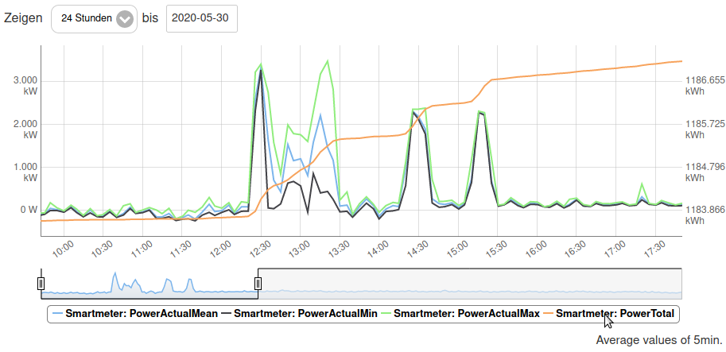
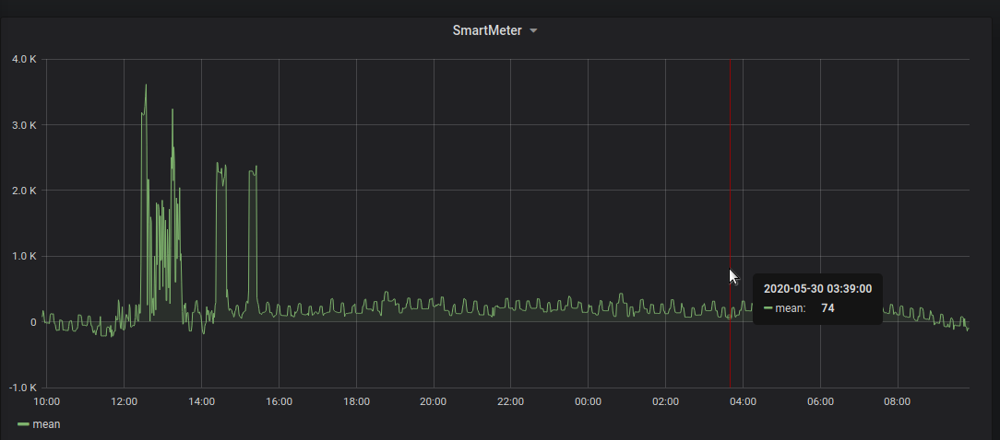
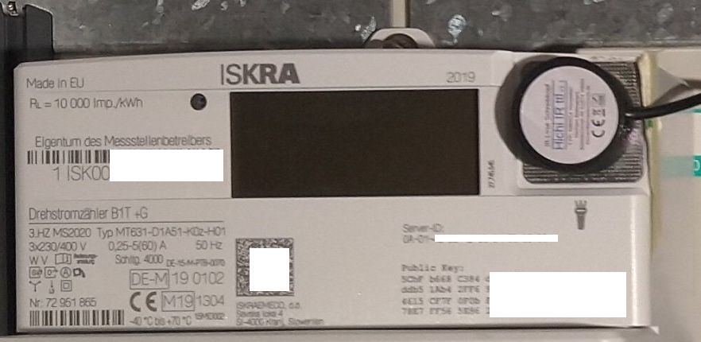
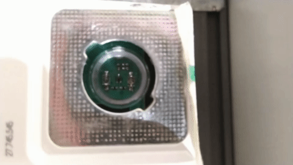

# SmlMqttProcessor

Process Smart Message Language ([SML](https://de.wikipedia.org/wiki/Smart_Message_Language)) from power smart meters with SML infra-red (IR) interface.

It depends heavily on the great [libsml](https://github.com/volkszaehler/libsml) library (GPL3 license), forked from [volkszaehler/libsml](https://github.com/volkszaehler/libsml).

Concept:
- This implementation uses a Rasperry Pi Zero with an atatched serial optical [TTL reader](https://wiki.volkszaehler.org/hardware/controllers/ir-schreib-lesekopf-ttl-ausgang) to capture SML data sent by a power smart meter.
- The SML processing is done by [libsml](https://github.com/volkszaehler/libsml).
- libsml's textual output is parsed, aggregated for a 1 minute time window and forwared as MQTT statements.
- The MQTT messages are used in e.g., [Pimatic.org](https://pimatic.org) smart home app to display the power consumption history, or using [Grafana](https://grafana.com).






## Motivation

I want to monitor the live/current power consumption,
and I want the values as MQTT messages.

- Know the current power consumption, e.g., to detect peaks, evaluate power production by photovoltaic system, save electricity, etc.
- The power grid operator installed a power smart meter which has an optical interface. This interface tells about the actual/current power consumption, encoded as SML messages.
- Aggregate the every-minute data for a time window (e.g., 1 minute) to produce mean, median, min/max, etc.
- Periodically (e.g., 1 minute) publish that aggregated data as MQTT messages.


## Requirements

* Python 3.5+
    * Python version or code level must be compatible to the Python version on the target system, e.g., Python 3.5 for Raspbian Jessie (05/2020).
* Python pipenv
* wget
* [volkszaehler/libsml](https://github.com/volkszaehler/libsml), version [6609c8117ba](https://github.com/volkszaehler/libsml/tree/6609c8117ba2c987aea386a7fffb9b4746636be6)

Hardware and runtime requirements:
* Raspberry Pi Zero with Raspbian Jessie.
* Optical TTL IR reader, directly attached to the Raspi TTL serial TX/RX GPIO pins.


## Setup & How-To

1. `git clone --recurse-submodules` this repository
   * ATTENTION: `--recurse-submodules` is needed (e.g., for libsml)!
2. `pipenv --site-packages sync`
3. Build `sml_server_time`, see [sml_server_time/README.md](sml_server_time/README.md).
4. Run in activated virtualenv and study CLI help:
   `pipenv run python smltextmqttprocessor.py --help`
5. Create local configuration file and adjust settings:
   `cp config.template.ini config.local.ini`
   * MQTT configuration: server host, port, user/password
     * `single_topic` boolean switch for all data in one single MQTT topic (default is `false`)
   * Serial port configuration
   * Block/Window size (for data aggregation)
6. Run in activated virtualenv:
   `./sml_server_time/sml_server_time /dev/ttyAMA0 | pipenv run python smltextmqttprocessor.py --config config.local.ini -`


### Run at Boot Time

After setting up, use systemd script in [./scripts/systemd/](./scripts/systemd/).
Basically it runs:
`ExecStart=/bin/sh -c '/opt/smlmqttprocessor/sml_server_time/sml_server_time /dev/ttyAMA0 | /opt/smlmqttprocessor/.venv/bin/python3 /opt/smlmqttprocessor/smltextmqttprocessor.py --config config.local.ini -q -'`


## Concept

The processing pipeline is:

| Input | Processing | Output |
| ----- | ---------- | ------ |
| Decoded SML data from IR smart meter reader | [smltextmqttprocessor.py](./smltextmqttprocessor.py) | MQTT messages |


### Sensor Hardware



TTL IR read-write reader, see [volkszaehler.org](https://wiki.volkszaehler.org/hardware/controllers/ir-schreib-lesekopf-ttl-ausgang).


### Input

My power smart meter model is Iskraemeco MT631. For details see [Wiki page of Volkszaehler.org](https://wiki.volkszaehler.org/hardware/channels/meters/power/edl-ehz/iskraemeco_mt631):
  * "The meter has a bidirectional IR interface in the upper right corner, which can be read by means of an IR read-write head at 9600bd, 8N1. The connection cable of the read head points down."
  * "The meter outputs the data in SML without request."

The [SML](https://de.wikipedia.org/wiki/Smart_Message_Language) data is like (also see [libsml examples](https://github.com/devZer0/libsml-testing)):
```
1B1B1B1B010101017605013880316200620072630101760101050068
2ABB0B0A0149534B0004325EC57262016500682793620163F9AB0076
0501388032620062007263070177010B0A0149534B0004325EC50701
00620AFFFF7262016500682793747707010060320101010101010449
534B0177070100600100FF010101010B0A0149534B0004325EC50177
070100010800FF65001C810401621E52FF65001E5A99017707010010
0700FF0101621B5200521A01010163BF270076050138803362006200
726302017101635567000000
```

The IR interface sends the SML data with a frequency of 1 signal per second.




### Processing

> `sml_server_time/sml_server_time /dev/ttyAMA0 | /python3 smltextmqttprocessor.py -`

The output of `sml_server_time` is piped to `smltextmqttprocessor.py`.


#### Step 1: `./sml_server_time/sml_server_time`

| Input | Processing | Output |
| ----- | ---------- | ------ |
| TTL serial data, from smart meter | SML decoding | decoded, textual output |

See [sml_server_time/README.md](sml_server_time/README.md). The executable binary `sml_server_time` is based on the libsml-example `sml_server`, but modified to also include the *act_sensor_time* data field.

The output of `sml_server_time` looks like (decoded SML data):
```
1-0:96.50.1*1#ISK#
1-0:96.1.0*255#0a 01 49 53 4b 00 04 32 5e c5 #
1-0:1.8.0*255#198927.3#Wh
1-0:16.7.0*255#26#W
act_sensor_time#6825875#
```

#### Step 2: `smltextmqttprocessor.py`

| Input | Processing | Output |
| ----- | ---------- | ------ |
| Textutal output from [sml_server_time](./sml_server_time/) | Parse heuristic, math aggregations (mean, min, max, ...);  MQTT message building | MQTT messages sent to broker |


### Output

The output on MQTT is like this (for multi-topic sending, config setting `single_topic=false`, which is the default):
```
tele/smartmeter/time/first 11824115
tele/smartmeter/time/last 11824175
tele/smartmeter/total/value 1189840.5
tele/smartmeter/actual/first 241.0
tele/smartmeter/actual/last 238.0
tele/smartmeter/actual/median 242.0
tele/smartmeter/actual/mean 242
tele/smartmeter/actual/min 235.0
tele/smartmeter/actual/max 254.0
```

For config setting `single_topic=true` (without line breaks; here only for readability purposes):
```
tele/smartmeter {
"time": {"first": 6825875, "last": 6825877},
"total": {"value": 198927.3, "first": 198927.3, "last": 198927.3,
   "median": 198927.3, "mean": 198927, "min": 198927.3, "max": 198927.3},
"actual": {"value": 27, "first": 26, "last": 27,
   "median": 26, "mean": 26, "min": 26, "max": 27}
}
```


## SML Links

* https://github.com/volkszaehler/libsml
* https://de.wikipedia.org/wiki/Smart_Message_Language
* https://www.msxfaq.de/sonst/bastelbude/smartmeter_d0_sml_protokoll.htm
* https://wiki.volkszaehler.org/software/sml
* Python, https://github.com/smarthomeNG/plugins/blob/master/sml/__init__.py
* SML-Examples: https://github.com/devZer0/libsml-testing
* OBIS Codes: https://wiki.volkszaehler.org/software/obis


## License

AGPL3, see [LICENSE.md](LICENSE.md).
