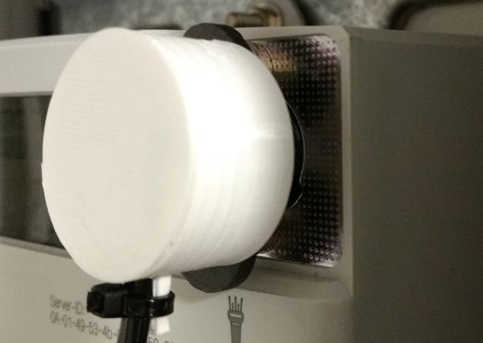
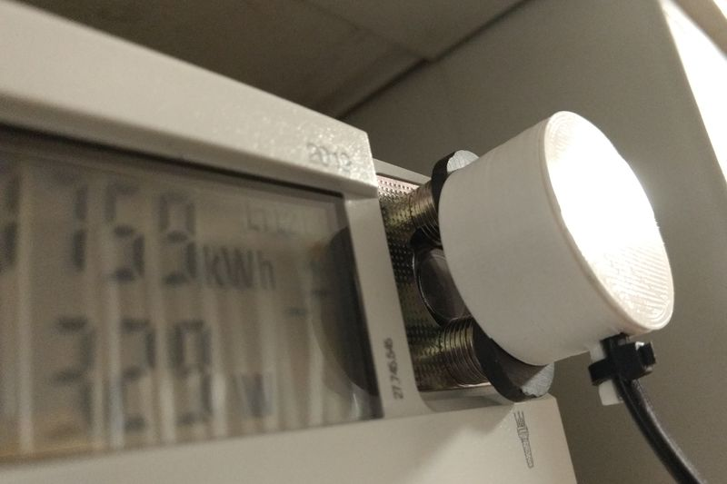

# SML Reading Problems

If anybody else has problems reading valid SML from smart meter:
I had some real problems working with my power meter and the IR TTL sensor reader. 
The normal, intended placement using the magnet and directly placing it on the IR window did not 
yield any valid SML data, but only garbage. 
However, a periodicity could be observed. 
After tedious experiments I found out that I need a very specific spacial and rotary alignment of 
the sensor, see the images above. I had to put a specific distance between the sensor and the 
meter's IR window; I used magnets for that. With this I got valid SML packages. But even little 
translatory or rotary deviation produced invalid SML messages.
Additional experiments showed that the IR TTL sensor was faulty.
If you experience similar problems, you should change/repair your sensor.
